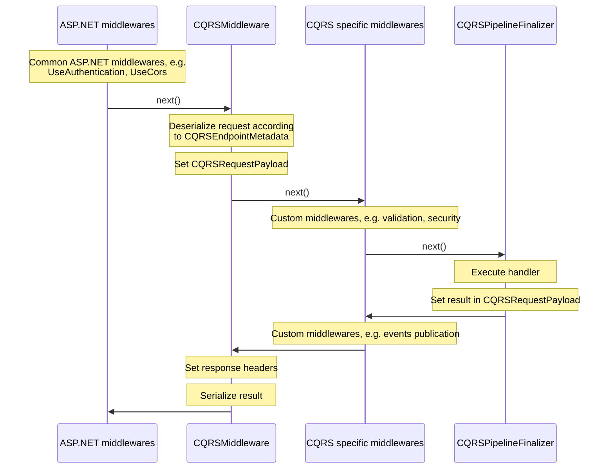

# Pipeline

The LeanCode CoreLibrary utilizes ASP.NET middlewares to create customized pipelines for handling commands/queries/operations. This section intends to showcase the setup of a basic pipeline and explore its inner workings.

## Packages

| Package | Link | Application in section |
| --- | ----------- | ----------- |
| LeanCode.CQRS.AspNetCore | [](https://www.nuget.org/packages/LeanCode.CQRS.AspNetCore/8.0.2260-preview/) | Configuration |
| LeanCode.CQRS.MassTransitRelay | [](https://www.nuget.org/packages/LeanCode.CQRS.MassTransitRelay/8.0.2260-preview/) | MassTransit related middlewares |

## Configuration

CQRS objects can only be registered in the ASP.NET request pipeline via endpoint routing. To register use `IEndpointRouteBuilder.MapRemoteCQRS(...)` extension method. In `MapRemoteCQRS(...)` you can configure the inner CQRS pipeline. In the following example, app is configured to handle:

- [Commands] at `/api/command/FullyQualifiedName`
- [Queries] at `/api/query/FullyQualifiedName`
- [Operations] at `/api/operation/FullyQualifiedName`

```csharp
    protected override void ConfigureApp(IApplicationBuilder app)
    {
        // . . .
        app.UseEndpoints(endpoints =>
            {
                endpoints.MapRemoteCQRS(
                    "/api",
                    cqrs =>
                    {
                        cqrs.Commands = c =>
                            c.CQRSTrace()
                            .Secure()
                            .Validate()
                            .CommitTransaction<CoreDbContext>()
                            .PublishEvents();

                        cqrs.Queries = c =>
                            c.CQRSTrace()
                            .Secure();

                        cqrs.Operations = c =>
                            c.CQRSTrace()
                            .Secure()
                            .CommitTransaction<CoreDbContext>()
                            .PublishEvents();
                    }
                );
            });
    }
```

!!! tip
    To learn about ASP.NET middlewares and how you can implement them, visit [here](https://learn.microsoft.com/en-us/aspnet/core/fundamentals/middleware/).

In this code snippet, you can specify which middlewares to use for handling commands, queries, and operations. Several middlewares are added in the example:

| Method                           | Middleware                             | Responsibility              |
|------------------------------- |--------------------------------------- |---------------------------- |
| [CQRSTrace()]                  | [CQRSTracingMiddleware]                | Tracing                     |
| [Secure()]                     | [CQRSSecurityMiddleware]               | Authorization               |
| [Validate()]                   | [CQRSValidationMiddleware]             | Validation                  |
| [CommitTransaction&lt;T&gt;()]  | [CommitDatabaseTransactionMiddleware]  | Saving changes to the database  |
| [PublishEvents()]              | [EventsPublisherMiddleware]            | Publishing domain events to MassTransit    |

The order in which these middlewares are added determines the sequence of execution. Additionally, there are a few other middlewares provided by library that can be incorporated into CQRS pipeline, although they are not covered in this basic example:

| Method                             | Middleware                               | Responsibility                                            |
|----------------------------------- |----------------------------------------- |--------------------------------------------------------- |
| [LogCQRSResponses()]                 | [ResponseLoggerMiddleware]               | Logging responses                                         |
| [LogCQRSResponsesOnNonProduction()]  | [NonProductionResponseLoggerMiddleware]  | Logging responses on non-production environments          |
| [TranslateExceptions()]              | [CQRSExceptionTranslationMiddleware]     | Capturing and translating exceptions into error codes  |

## Request handling

The process of request handling can be illustrated by diagram below:



The process begins with the invocation of common ASP.NET middlewares, such as `UseAuthentication` and `UseCors`, prior to the execution of the [MapRemoteCQRS(...)] method. This method, adds the [CQRSMiddleware], initiating the pipeline. During this stage, the request undergoes deserialization and the [CQRSRequestPayload] is set on `HttpContext`.

Subsequently, the pipeline executes additional custom middlewares, responsible for tasks like [validation] and [authorization]. Following the successful execution of these middlewares, the specific handler is invoked inside [CQRSPipelineFinalizer]. Upon handler execution, the result is assigned to the [CQRSRequestPayload].

[EventsPublisherMiddleware] then facilitates the publication of events (assuming it's added to the pipeline in [MapRemoteCQRS(...)]). Towards the conclusion of the pipeline, response headers are configured, and the result is serialized inside [CQRSMiddleware]. Finally, the serialized result is returned to the client, completing the request handling process.

[MapRemoteCQRS(...)]: https://github.com/leancodepl/corelibrary/blob/v8.0-preview/src/CQRS/LeanCode.CQRS.AspNetCore/CQRSEndpointRouteBuilderExtensions.cs#L13
[CQRSTrace()]: https://github.com/leancodepl/corelibrary/blob/v8.0-preview/src/CQRS/LeanCode.CQRS.AspNetCore/CQRSApplicationBuilder.cs#L62
[Validate()]: https://github.com/leancodepl/corelibrary/blob/v8.0-preview/src/CQRS/LeanCode.CQRS.AspNetCore/CQRSApplicationBuilder.cs#L38
[Secure()]: https://github.com/leancodepl/corelibrary/blob/v8.0-preview/src/CQRS/LeanCode.CQRS.AspNetCore/CQRSApplicationBuilder.cs#L44
[LogCQRSResponsesOnNonProduction()]: https://github.com/leancodepl/corelibrary/blob/v8.0-preview/src/CQRS/LeanCode.CQRS.AspNetCore/CQRSApplicationBuilder.cs#L50
[LogCQRSResponses()]: https://github.com/leancodepl/corelibrary/blob/v8.0-preview/src/CQRS/LeanCode.CQRS.AspNetCore/CQRSApplicationBuilder.cs#L56
[TranslateExceptions()]: https://github.com/leancodepl/corelibrary/blob/v8.0-preview/src/CQRS/LeanCode.CQRS.AspNetCore/CQRSApplicationBuilder.cs#L68
[CommitTransaction&lt;T&gt;()]: https://github.com/leancodepl/corelibrary/blob/v8.0-preview/src/CQRS/LeanCode.CQRS.MassTransitRelay/MassTransitRelayApplicationBuilderExtensions.cs#L9
[PublishEvents()]: https://github.com/leancodepl/corelibrary/blob/v8.0-preview/src/CQRS/LeanCode.CQRS.MassTransitRelay/MassTransitRelayApplicationBuilderExtensions.cs#L16
[CQRSTracingMiddleware]: https://github.com/leancodepl/corelibrary/blob/v8.0-preview/src/CQRS/LeanCode.CQRS.AspNetCore/Middleware/CQRSTracingMiddleware.cs
[CQRSSecurityMiddleware]: https://github.com/leancodepl/corelibrary/blob/v8.0-preview/src/CQRS/LeanCode.CQRS.AspNetCore/Middleware/CQRSSecurityMiddleware.cs
[CQRSValidationMiddleware]: https://github.com/leancodepl/corelibrary/blob/v8.0-preview/src/CQRS/LeanCode.CQRS.AspNetCore/Middleware/CQRSValidationMiddleware.cs
[CommitDatabaseTransactionMiddleware]: https://github.com/leancodepl/corelibrary/blob/v8.0-preview/src/CQRS/LeanCode.CQRS.MassTransitRelay/Middleware/CommitDatabaseTransactionMiddleware.cs
[EventsPublisherMiddleware]: https://github.com/leancodepl/corelibrary/blob/v8.0-preview/src/CQRS/LeanCode.CQRS.MassTransitRelay/Middleware/EventsPublisherMiddleware.cs
[NonProductionResponseLoggerMiddleware]: https://github.com/leancodepl/corelibrary/blob/v8.0-preview/src/CQRS/LeanCode.CQRS.AspNetCore/Middleware/NonProductionResponseLoggerMiddleware.cs
[ResponseLoggerMiddleware]: https://github.com/leancodepl/corelibrary/blob/v8.0-preview/src/CQRS/LeanCode.CQRS.AspNetCore/Middleware/ResponseLoggerMiddleware.cs
[CQRSExceptionTranslationMiddleware]: https://github.com/leancodepl/corelibrary/blob/v8.0-preview/src/CQRS/LeanCode.CQRS.AspNetCore/Middleware/CQRSExceptionTranslationMiddleware.cs
[CQRSMiddleware]: https://github.com/leancodepl/corelibrary/blob/v8.0-preview/src/CQRS/LeanCode.CQRS.AspNetCore/Middleware/CQRSMiddleware.cs
[CQRSRequestPayload]: https://github.com/leancodepl/corelibrary/blob/v8.0-preview/src/CQRS/LeanCode.CQRS.Execution/CQRSRequestPayload.cs
[CQRSPipelineFinalizer]: https://github.com/leancodepl/corelibrary/blob/v8.0-preview/src/CQRS/LeanCode.CQRS.AspNetCore/Middleware/CQRSPipelineFinalizer.cs
[Commands]: ../command/index.md
[Queries]: ../query/index.md
[Operations]: ../operation/index.md
[authorization]: ../authorization/index.md
[validation]: ../validation/index.md
