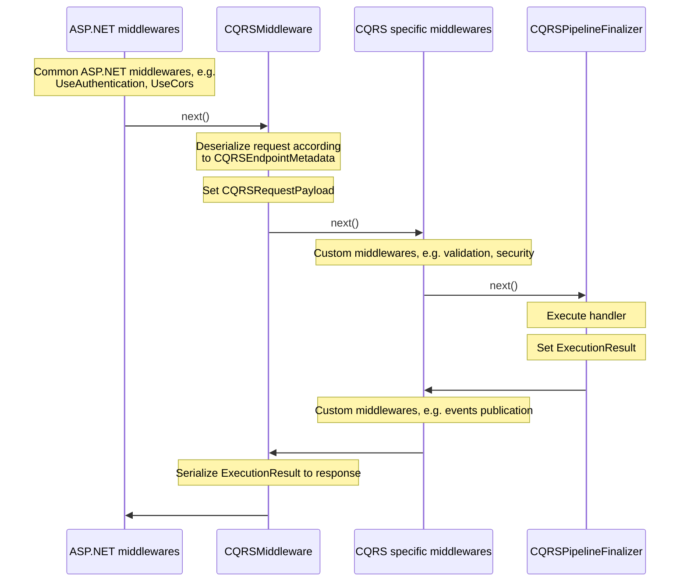

# Pipeline

The LeanCode CoreLibrary utilizes ASP.NET middlewares to create customized pipelines for handling commands/queries/operations. This section intends to showcase the setup of a basic pipeline and explore its inner workings.

## Packages

| Package | Link | Application in section |
| --- | ----------- | ----------- |
| LeanCode.CQRS.AspNetCore | [](https://www.nuget.org/packages/LeanCode.CQRS.AspNetCore) | Configuration |
| LeanCode.CQRS.MassTransitRelay | [](https://www.nuget.org/packages/LeanCode.CQRS.MassTransitRelay) | MassTransit related middlewares |

## Configuration

CQRS objects need to be registered in two places:

1. Handlers need to be registered in DI,
2. Routes for CQRS objects execution need to be registered in ASP.NET Core routing as endpoints.

### DI

To register handlers in DI, use [AddCQRS(...)] calls. There, you need to specify two `TypesCatalog`s:

1. One that contains all available contracts,
2. One that contains all necessary handlers.

You cannot call [AddCQRS(...)] twice - all objects need to be registered in one go.

```csharp
public override void ConfigureServices(IServiceCollection services)
{
    services.AddCQRS(TypesCatalog.Of<ExampleCommand>(), TypesCatalog.Of<ExampleHandler>());
}
```

[AddCQRS(...)] returns aa [CQRSServicesBuilder] that allows to further modify CQRS registration by, e.g., adding objects one-by-one, registering predefined libraries like [force update](../../features/force_update/index.md) or registering [local executors](../local_execution/index.md).

### Endpoints

CQRS objects can be registered in the ASP.NET request pipeline via endpoint routing. To register, use [MapRemoteCQRS(...)] extension method. In `MapRemoteCQRS(...)` you can configure the inner CQRS pipeline. In the following example, app is configured to handle:

- [Commands] at `/api/command/FullyQualifiedName`
- [Queries] at `/api/query/FullyQualifiedName`
- [Operations] at `/api/operation/FullyQualifiedName`

Endpoint routing cannot execute handlers that are not in DI, thus the `MapRemoteCQRS(...)` call will ignore objects that were not found by `AddCQRS(...)`.

```csharp
protected override void ConfigureApp(IApplicationBuilder app)
{
    // . . .
    app.UseEndpoints(endpoints =>
        {
            endpoints.MapRemoteCQRS(
                "/api",
                cqrs =>
                {
                    cqrs.Commands = c =>
                        c.Secure()
                        .Validate()
                        .CommitTransaction<CoreDbContext>()
                        .PublishEvents();

                    cqrs.Queries = c =>
                        c.Secure()
                        .CacheOutput();

                    cqrs.Operations = c =>
                        c.Secure()
                        .CacheOutput()
                        .CommitTransaction<CoreDbContext>()
                        .PublishEvents();
                }
            );
        });
}
```

!!! tip
    To learn about ASP.NET middlewares and how you can implement them, visit the [ASP.NET Core Middleware documentation](https://learn.microsoft.com/en-us/aspnet/core/fundamentals/middleware/).

In this code snippet, you can specify which middlewares to use for handling commands, queries, and operations. Several middlewares are added in the example:

| Method                          | Middleware                            | Responsibility                             |
|-------------------------------- |---------------------------------------|------------------------------------------- |
| [Secure()]                      | [CQRSSecurityMiddleware]              | Authorization                              |
| [Validate()]                    | [CQRSValidationMiddleware]            | Validation                                 |
| [CacheOutput()]                 | [OutputCacheMiddleware]               | Caching query and operation responses      |
| [CommitTransaction&lt;T&gt;()]  | [CommitDatabaseTransactionMiddleware] | Saving changes to the database             |
| [PublishEvents()]               | [EventsPublisherMiddleware]           | Publishing domain events to MassTransit    |

The order in which these middlewares are added determines the sequence of execution. Additionally, there are a few other middlewares provided by library that can be incorporated into CQRS pipeline, although they are not covered in this basic example:

| Method                               | Middleware                               | Responsibility                                            |
|------------------------------------- |----------------------------------------- |---------------------------------------------------------- |
| [LogCQRSResponses()]                 | [ResponseLoggerMiddleware]               | Logging responses                                         |
| [LogCQRSResponsesOnNonProduction()]  | [NonProductionResponseLoggerMiddleware]  | Logging responses on non-production environments          |
| [TranslateExceptions()]              | [CQRSExceptionTranslationMiddleware]     | Capturing and translating exceptions into error codes     |

## Request handling

The process of request handling can be illustrated by diagram below:


```mermaid
sequenceDiagram
    participant aspnet as ASP.NET middlewares
    participant start as CQRSMiddleware
    participant middle as CQRS specific middlewares
    participant final as CQRSPipelineFinalizer

    Note over aspnet: Common ASP.NET middlewares, e.g. <br/> UseAuthentication, UseCors

    aspnet ->> start: next()

    Note over start: Deserialize request according <br/> to CQRSEndpointMetadata
    Note over start: Set CQRSRequestPayload

    start ->> middle: next()
    Note over middle: Custom middlewares, e.g. validation, security

    middle ->> final: next()

    Note over final: Execute handler
    Note over final: Set ExecutionResult

    final ->> middle: #0160;
    Note over middle: Custom middlewares, e.g. events publication

    middle ->> start: #0160;

    Note over start: Serialize ExecutionResult to response

    start ->> aspnet: #0160;

```

The process begins with the invocation of common ASP.NET middlewares, such as `UseAuthentication` and `UseCors`, prior to the execution of the [MapRemoteCQRS(...)] method. This method, adds the [CQRSMiddleware], initiating the pipeline. During this stage, the request undergoes deserialization and the [CQRSRequestPayload] is set on `HttpContext`.

Subsequently, the pipeline executes additional custom middlewares, responsible for tasks like [authorization], [validation] or [output-caching]. Following the successful execution of these middlewares, the specific handler is invoked inside [CQRSPipelineFinalizer]. Upon handler execution, the [ExecutionResult] is set on the `HttpContext`.

[EventsPublisherMiddleware] then facilitates the publication of events (assuming it's added to the pipeline in [MapRemoteCQRS(...)]). Towards the conclusion of the pipeline, the [ExecutionResult] is serialized to the response inside [CQRSMiddleware]. Finally, the serialized result is returned to the client, completing the request handling process.

!!! note "Serialization with Output Caching"
    When output caching is enabled via `.CacheOutput()`, the serialization is handled differently. A [CQRSResponseSerializerMiddleware] is added after the OutputCache middleware to ensure proper serialization timing for cache storage. In this case, [CQRSMiddleware] delegates serialization to that middleware.

[AddCQRS(...)]: https://github.com/leancodepl/corelibrary/blob/HEAD/src/CQRS/LeanCode.CQRS.AspNetCore/ServiceCollectionCQRSExtensions.cs#L17
[CQRSServicesBuilder]: https://github.com/leancodepl/corelibrary/blob/HEAD/src/CQRS/LeanCode.CQRS.AspNetCore/ServiceCollectionCQRSExtensions.cs#L46
[MapRemoteCQRS(...)]: https://github.com/leancodepl/corelibrary/blob/HEAD/src/CQRS/LeanCode.CQRS.AspNetCore/CQRSEndpointRouteBuilderExtensions.cs#L13
[Validate()]: https://github.com/leancodepl/corelibrary/blob/HEAD/src/CQRS/LeanCode.CQRS.AspNetCore/CQRSApplicationBuilder.cs#L38
[Secure()]: https://github.com/leancodepl/corelibrary/blob/HEAD/src/CQRS/LeanCode.CQRS.AspNetCore/CQRSApplicationBuilder.cs#L44
[CacheOutput()]: https://github.com/leancodepl/corelibrary/blob/HEAD/src/CQRS/LeanCode.CQRS.AspNetCore/CQRSApplicationBuilder.cs#L50
[LogCQRSResponsesOnNonProduction()]: https://github.com/leancodepl/corelibrary/blob/HEAD/src/CQRS/LeanCode.CQRS.AspNetCore/CQRSApplicationBuilder.cs#L56
[LogCQRSResponses()]: https://github.com/leancodepl/corelibrary/blob/HEAD/src/CQRS/LeanCode.CQRS.AspNetCore/CQRSApplicationBuilder.cs#L62
[TranslateExceptions()]: https://github.com/leancodepl/corelibrary/blob/HEAD/src/CQRS/LeanCode.CQRS.AspNetCore/CQRSApplicationBuilder.cs#L68
[CommitTransaction&lt;T&gt;()]: https://github.com/leancodepl/corelibrary/blob/HEAD/src/CQRS/LeanCode.CQRS.MassTransitRelay/MassTransitRelayApplicationBuilderExtensions.cs#L9
[PublishEvents()]: https://github.com/leancodepl/corelibrary/blob/HEAD/src/CQRS/LeanCode.CQRS.MassTransitRelay/MassTransitRelayApplicationBuilderExtensions.cs#L16
[CQRSSecurityMiddleware]: https://github.com/leancodepl/corelibrary/blob/HEAD/src/CQRS/LeanCode.CQRS.AspNetCore/Middleware/CQRSSecurityMiddleware.cs
[CQRSValidationMiddleware]: https://github.com/leancodepl/corelibrary/blob/HEAD/src/CQRS/LeanCode.CQRS.AspNetCore/Middleware/CQRSValidationMiddleware.cs
[OutputCacheMiddleware]: https://github.com/dotnet/aspnetcore/blob/main/src/Middleware/OutputCaching/src/OutputCacheMiddleware.cs
[CommitDatabaseTransactionMiddleware]: https://github.com/leancodepl/corelibrary/blob/HEAD/src/CQRS/LeanCode.CQRS.MassTransitRelay/Middleware/CommitDatabaseTransactionMiddleware.cs
[EventsPublisherMiddleware]: https://github.com/leancodepl/corelibrary/blob/HEAD/src/CQRS/LeanCode.CQRS.MassTransitRelay/Middleware/EventsPublisherMiddleware.cs
[NonProductionResponseLoggerMiddleware]: https://github.com/leancodepl/corelibrary/blob/HEAD/src/CQRS/LeanCode.CQRS.AspNetCore/Middleware/NonProductionResponseLoggerMiddleware.cs
[ResponseLoggerMiddleware]: https://github.com/leancodepl/corelibrary/blob/HEAD/src/CQRS/LeanCode.CQRS.AspNetCore/Middleware/ResponseLoggerMiddleware.cs
[CQRSExceptionTranslationMiddleware]: https://github.com/leancodepl/corelibrary/blob/HEAD/src/CQRS/LeanCode.CQRS.AspNetCore/Middleware/CQRSExceptionTranslationMiddleware.cs
[CQRSMiddleware]: https://github.com/leancodepl/corelibrary/blob/HEAD/src/CQRS/LeanCode.CQRS.AspNetCore/Middleware/CQRSMiddleware.cs
[CQRSRequestPayload]: https://github.com/leancodepl/corelibrary/blob/HEAD/src/CQRS/LeanCode.CQRS.Execution/CQRSRequestPayload.cs
[CQRSPipelineFinalizer]: https://github.com/leancodepl/corelibrary/blob/HEAD/src/CQRS/LeanCode.CQRS.AspNetCore/Middleware/CQRSPipelineFinalizer.cs
[ExecutionResult]: https://github.com/leancodepl/corelibrary/blob/HEAD/src/CQRS/LeanCode.CQRS.Execution/ExecutionResult.cs
[CQRSResponseSerializerMiddleware]: https://github.com/leancodepl/corelibrary/blob/HEAD/src/CQRS/LeanCode.CQRS.AspNetCore/Middleware/CQRSResponseSerializerMiddleware.cs
[Commands]: ../command/index.md
[Queries]: ../query/index.md
[Operations]: ../operation/index.md
[authorization]: ../authorization/index.md
[validation]: ../validation/index.md
[output-caching]: ../output_caching/index.md
