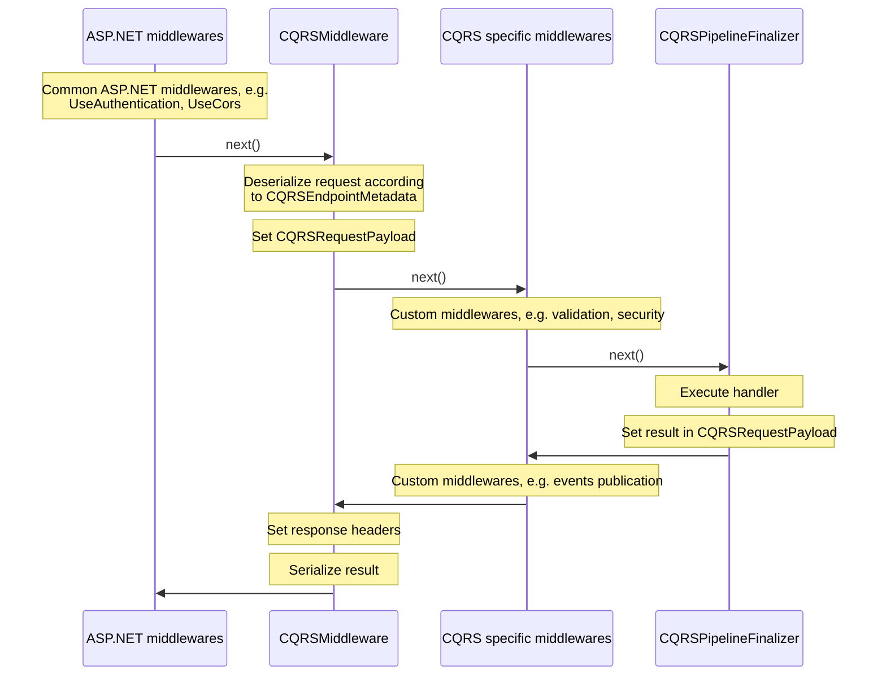

# LeanCode.CoreLibrary v8.0 changes overview & migration guide

## Dependency injection & startup changes changes

Autofac is no longer the DI container of choice, corelibrary projects use `Microsoft.Extension.DependencyInjection`.
Autofac based `IAppModule`s are still available in `LeanCode.Components.Autofac` however no project depends on it.

Instead services are registered via extension methods on `Microsoft.Extension.DependencyInjection.IServiceCollection`.
Typically an `XYZModule` class was replaced with `AddXYZ()` extension method (e.g. `AddSmsSender()` replaced `SmsSenderModule`)

Additionally, modules requiring configuration now require passing it explicitly when registering services. E.g. previously adding `SmsSenderModule` required the client to additionally register `SmsApiConfiguration` class. Now, the configuration class is required when calling `AddSmsSender()` method.

## Startup changes

There are two startup projects:

- `LeanCode.Startup.MicrosoftDI`
- `LeanCode.Startup.Autofac` - replacing and compatible with old `LeanCode.Components.Startup`

It's up to the project author to decide with DI container they want to use. Both contain `LeanProgram` and `LeanStartup` helper classes.

Helper methods for setting up logging and Azure Key Vault configuration were moved to `LeanCode.Logging` and `LeanCode.AzureIdentity` respectively.

## CQRS changes

### Deeper ASP.NET Core integration

Our custom pipelines were removed, now all the CQRS execution is tied to the ASP.NET Core request handling. All the pipeline elements(e.g. security/validation were rewritten to be ASP.NET middlewares). In-proc `ICommandExecutor`/`IQueryExecutor`/`IOperationExecutor` interfaces were removed, the only way to invoke CQRS is via HTTP.

Previous projects: `LeanCode.Pipelines`, `LeanCode.Pipelines.Autofac`, `LeanCode.CQRS.Default` were replaced by `LeanCode.CQRS.AspNetCore`.

### Replacing app contexts with HttpContext

The concept of application context was abandoned. Handlers and middlewares (ex pipeline elements) now have access to `HttpContext` directly.
The new command/query/operation handlers interfaces look like:

```csharp
public interface ICommandHandler<in TCommand>
    where TCommand : ICommand
{
    Task ExecuteAsync(HttpContext context, TCommand command);
}

public interface IQueryHandler<in TQuery, TResult>
    where TQuery : IQuery<TResult>
{
    Task<TResult> ExecuteAsync(HttpContext context, TQuery query);
}

public interface IOperationHandler<in TOperation, TResult>
    where TOperation : IOperation<TResult>
{
    Task<TResult> ExecuteAsync(HttpContext context, TOperation operation);
}
```

Application are free to read from `HttpContext`, however writing responses directly is discouraged, unless there is a good reason to do so.

### Registration example

Here's a minimal example of CQRS app Startup code

```csharp
public override void ConfigureServices(IServiceCollection services)
{
    var contractsAssemblies = TypesCatalog.Of<CreateDish>();
    var handlersAssemblies = TypesCatalog.Of<CreateDishCH>();

    services.AddRouting();
    services.AddCQRS(contractsAssemblies, handlersAssemblies);
    services.AddFluentValidation(handlersAssemblies);
}

protected override void ConfigureApp(IApplicationBuilder app)
{
    app.UseRouting();
    app.UseEndpoints(
        e =>
            e.MapRemoteCqrs(
                "/api",
                cfg =>
                {
                    cfg.Commands = c => c.Secure().Validate();
                    cfg.Queries = q => q.Secure();
                    cfg.Operations = o => o.Secure();
                }
            )
    );
}
```

### Middleware writing

`IPipelineElement<TContext, TInput, TOutput>` was replaced with plain ASP.NET middlewares. There are helper methods to get CQRS related information from `HttpContext`.

```csharp
public Task(HttpContext httpContext)
{
    var endpointMetadata = httpContext.GetCQRSEndpoint();
    var objectMetadata = endpointMetadata.ObjectMetadata;

    CQRSObjectKind objectKind = objectMetadata.ObjectKind; // query/command/operation
    Type objectType = objectMetadata.ObjectType;
    Type resultType = objectMetadata.ResultType;
    Type handlerType = objectMetadata.HandlerType;

    object payload = httpContext.GetCQRSRequestPayload().Payload;

    return next(httpContext);
}
```

**NOTE**: Since CQRS related middlewares are plain ASP.NET middleware, it's possible to register them outside of `MapRemoteCQRS` method. This will throw a runtime exception since `GetCQRSEndpoint()` and `GetCQRSRequestPayload()` require CQRS metadata to be present in `HttpContext` (see the chart below)

### CQRS Request handling



### Fluent validation changes

The `ContextualValidator.RuleForAsync()` was removed due to problems with upgrading to newer `FluentValidation` versions and general impedance with _fluent_ approach. Instead clients should rewrite the validator to use imperative approach with `AbstractValidator.CustomAsync()`.

There is a `IRuleBuilderOptions.AddValidationError()` extension which allows setting CQRS error code to the validation error.

Example old approach:

```csharp
public class CreateDishCV : ContextualValidator<CreateDish>
{
    public CreateDishCV()
    {
        this.RuleForAsync(
            c => c.DishId,
            (ctx, id) => ctx.GetService<IRepository<Dish>>().FindAsync(id))
            .Null().WithCode(CreateDish.ErrorCodes.DishAlreadyExists);
    }
}
```

Example new approach:

```csharp
public class CreateDishCV : AbstractValidator<CreateDish>
{
    public CreateDishCV()
    {
        RuleFor(c => c.DishId)
            .CustomAsync((Guid dishId, ValidationContext<CreateDish> ctx, CancellationToken ct) =>
            {
                var dish = await ctx.GetService<IRepository<Dish>>().FindAsync(id, ct);
                if(dish is not null)
                {
                  ctx.AddValidationError("Dish already exists", CreateDish.ErrorCodes.DishAlreadyExists);
                }
            });
    }
}
```

Removal of `ContextualValidator` class allowed to merge `LeanCode.Validation.Fluent` and `LeanCode.Validation.Fluent.Scoped` projects - lifetime of validators is now a parameter of `IServiceCollection.AddFluentValidation()` method (scoped by default)

## MassTransit changes

`LeanCode.DomainModels.MassTransitRelay` was renamed to `LeanCode.CQRS.MassTransitRelay`

### Registration & startup changes

`MassTransitRelayModule` was removed. Instead use `serviceCollection.AddCQRSMassTransitIntegration()` method. Similarly `MassTransitTestRelayModule` was replaced with `serviceCollection.AddBusActivityMonitor()`

#### Consumer definitions

It's now encouraged to create a separate receive endpoint per each consumer. To configure each consumer use a [consumer definition](https://masstransit.io/documentation/concepts/consumers#definitions). Since most of the consumers will have the same configuration a helper default consumer utility was created. Any consumer that does not have a definition will pick up the default one. Additionally, conventional receive endpoint (queue) name will be just the consumer name - if you want to use full namespace name, you'll need to set the name formatter.

```csharp
public void ConfigureServices(IServiceCollection services)
{
    services.AddCQRSMassTransitIntegration(busCfg =>
    {
        busCfg.AddConsumersWithDefaultConfiguration(
            new[] { typeof(MyConsumer).Assembly },
            typeof(DefaultConsumerDefinition<>)
            );

        busCfg.UsingInMemory(
            (ctx, cfg) =>
            {
                var formatter = new DefaultEndpointNameFormatter(
                    includeNamespace: true,
                    joinSeparator: ".",
                    prefix: null
                    );
                cfg.ConfigureEndpoints(ctx, formatter);
            }
        );
    });
}


public class DefaultConsumerDefinition<TConsumer> : ConsumerDefinition<TConsumer>
    where TConsumer : class, IConsumer
{
    private readonly IServiceProvider serviceProvider;

    public DefaultConsumerDefinition(IServiceProvider serviceProvider)
    {
        this.serviceProvider = serviceProvider;
    }

    protected override void ConfigureConsumer(
        IReceiveEndpointConfigurator endpointConfigurator,
        IConsumerConfigurator<TConsumer> consumerConfigurator
    )
    {
        endpointConfigurator.UseRetry(r => r.Immediate(1));
        endpointConfigurator.UseEntityFrameworkOutbox<TestDbContext>(serviceProvider);
        endpointConfigurator.UseDomainEventsPublishing(serviceProvider);
    }
}

```

### Migration to MT provided inbox/outbox

Our custom inbox/outbox was replaced with Mass Transit [Transactional Outbox](https://masstransit.io/documentation/patterns/transactional-outbox). You'll need to configure outbox entities in your db context and register outbox when configuring Mass Transit

```csharp
public void ConfigureServices(IServiceCollection services)
{
    services.AddCQRSMassTransitIntegration(busCfg =>
    {
        busCfg.AddEntityFrameworkOutbox<MyDbContext>(outboxCfg =>
        {
            outboxCfg.UseSqlServer(); // Use your database flavor
            outboxCfg.UseBusOutbox();
        });

        busCfg.UsingInMemory(
            (ctx, cfg) =>
            {
                cfg.ConfigureEndpoints(ctx);
            }
        );
    });
}


class MyDbContext: DbContext
{
    protected override void OnModelCreating(ModelBuilder modelBuilder)
    {
        modelBuilder.AddInboxStateEntity();
        modelBuilder.AddOutboxMessageEntity();
        modelBuilder.AddOutboxStateEntity();
    }
}
```

## Misc changes

...
