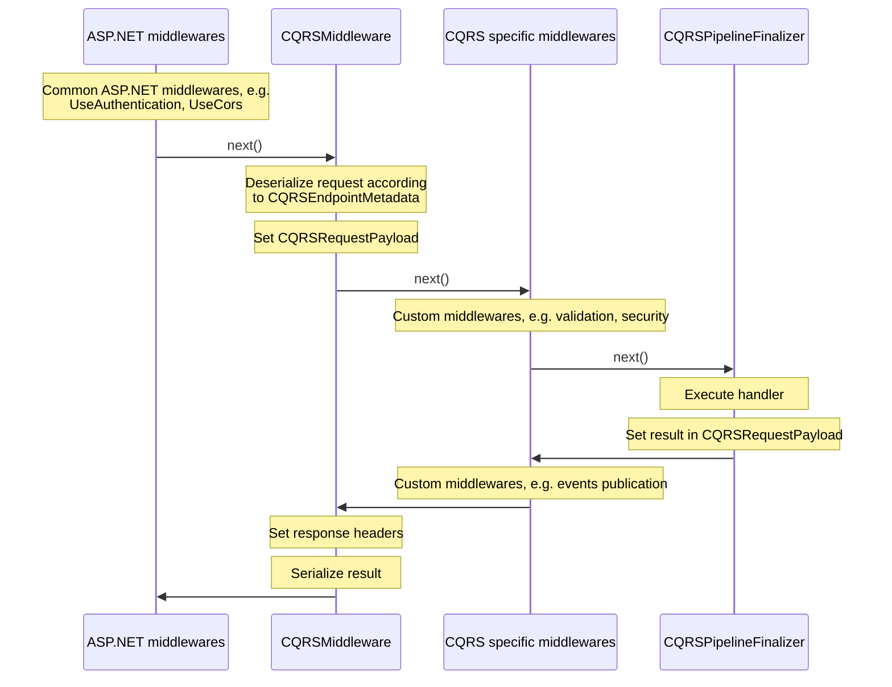

# LeanCode.CoreLibrary v8.0 changes overview & migration guide

## Dependency injection & startup changes changes

Autofac is no longer the DI container of choice, corelibrary projects use `Microsoft.Extension.DependencyInjection`.  Autofac based `IAppModule`s are still available in `LeanCode.Components.Autofac` however no project depends on it.

Instead services are registered via extension methods on `Microsoft.Extension.DependencyInjection.IServiceCollection`.  Typically an `XYZModule` class was replaced with `AddXYZ()` extension method (e.g. `AddSmsSender()` replaced `SmsSenderModule`)

Additionally, modules requiring configuration now require passing it explicitly when registering services. E.g. previously adding `SmsSenderModule` required the client to additionally register `SmsApiConfiguration` class. Now, the configuration class is required when calling `AddSmsSender()` method.

## Startup changes

There are two startup projects:

- `LeanCode.Startup.MicrosoftDI`
- `LeanCode.Startup.Autofac` - replacing and compatible with old `LeanCode.Components.Startup`

It's up to the project author to decide with DI container they want to use. Both contain `LeanProgram` and `LeanStartup` helper classes.

Helper methods for setting up logging and Azure Key Vault configuration were moved to `LeanCode.Logging` and `LeanCode.AzureIdentity` respectively.

## CQRS changes

### Deeper ASP.NET Core integration

Our custom pipelines were removed, now all the CQRS execution is tied to the ASP.NET Core request handling. All the pipeline elements(e.g. security/validation were rewritten to be ASP.NET middlewares). In-proc `ICommandExecutor`/`IQueryExecutor`/`IOperationExecutor` interfaces were removed, the only way to invoke CQRS is via HTTP.

Previous projects: `LeanCode.Pipelines`, `LeanCode.Pipelines.Autofac`, `LeanCode.CQRS.Default` were replaced by `LeanCode.CQRS.AspNetCore`.

### Replacing app contexts with HttpContext

The concept of application context was abandoned. Handlers and middlewares (former `IPipelineElement`s) now have access to `HttpContext` directly.
The new command/query/operation handlers interfaces look like:

```csharp
public interface ICommandHandler<in TCommand>
    where TCommand : ICommand
{
    Task ExecuteAsync(HttpContext context, TCommand command);
}

public interface IQueryHandler<in TQuery, TResult>
    where TQuery : IQuery<TResult>
{
    Task<TResult> ExecuteAsync(HttpContext context, TQuery query);
}

public interface IOperationHandler<in TOperation, TResult>
    where TOperation : IOperation<TResult>
{
    Task<TResult> ExecuteAsync(HttpContext context, TOperation operation);
}
```

Application are free to read from `HttpContext`, however writing responses directly is discouraged, unless there is a good reason to do so.

### Registration example

Here's a minimal example of CQRS app Startup code

```csharp
public override void ConfigureServices(IServiceCollection services)
{
    var contractsAssemblies = TypesCatalog.Of<CreateDish>();
    var handlersAssemblies = TypesCatalog.Of<CreateDishCH>();

    services.AddRouting();
    services.AddCQRS(contractsAssemblies, handlersAssemblies);
    services.AddFluentValidation(handlersAssemblies);
}

protected override void ConfigureApp(IApplicationBuilder app)
{
    app.UseRouting();
    app.UseEndpoints(
        e =>
            e.MapRemoteCqrs(
                "/api",
                cfg =>
                {
                    cfg.Commands = c => c.Secure().Validate();
                    cfg.Queries = q => q.Secure();
                    cfg.Operations = o => o.Secure();
                }
            )
    );
}
```

### Middleware writing

`IPipelineElement<TContext, TInput, TOutput>` was replaced with plain ASP.NET middlewares. There are helper methods to get CQRS related information from `HttpContext`.

```csharp
public Task InvokeAsync(HttpContext httpContext)
{
    var endpointMetadata = httpContext.GetCQRSEndpoint();
    var objectMetadata = endpointMetadata.ObjectMetadata;

    CQRSObjectKind objectKind = objectMetadata.ObjectKind; // query/command/operation
    Type objectType = objectMetadata.ObjectType;
    Type resultType = objectMetadata.ResultType;
    Type handlerType = objectMetadata.HandlerType;

    object payload = httpContext.GetCQRSRequestPayload().Payload;

    return next(httpContext);
}
```

**NOTE**: Since CQRS related middlewares are plain ASP.NET middleware, it's possible to register them outside of `MapRemoteCQRS` method. This will throw a runtime exception since `GetCQRSEndpoint()` and `GetCQRSRequestPayload()` require CQRS metadata to be present in `HttpContext` (see the chart below)

### CQRS Request handling



### Fluent validation changes

The `ContextualValidator.RuleForAsync()` was removed due to problems with upgrading to newer `FluentValidation` versions and general impedance with _fluent_ approach. Instead clients should rewrite the validator to use imperative approach with `AbstractValidator.CustomAsync()`.

There is a `IRuleBuilderOptions.AddValidationError()` extension which allows setting CQRS error code to the validation error.

Example old approach:

```csharp
public class CreateDishCV : ContextualValidator<CreateDish>
{
    public CreateDishCV()
    {
        this.RuleForAsync(
            c => c.DishId,
            (ctx, id) => ctx.GetService<IRepository<Dish>>().FindAsync(id))
            .Null().WithCode(CreateDish.ErrorCodes.DishAlreadyExists);
    }
}
```

Example new approach:

```csharp
public class CreateDishCV : AbstractValidator<CreateDish>
{
    public CreateDishCV()
    {
        RuleFor(c => c.DishId)
            .CustomAsync((Guid dishId, ValidationContext<CreateDish> ctx, CancellationToken ct) =>
            {
                var dish = await ctx.GetService<IRepository<Dish>>().FindAsync(id, ct);
                if(dish is not null)
                {
                  ctx.AddValidationError("Dish already exists", CreateDish.ErrorCodes.DishAlreadyExists);
                }
            });
    }
}
```

Removal of `ContextualValidator` class allowed to merge `LeanCode.Validation.Fluent` and `LeanCode.Validation.Fluent.Scoped` projects - lifetime of validators is now a parameter of `IServiceCollection.AddFluentValidation()` method (scoped by default)

## MassTransit changes

`LeanCode.DomainModels.MassTransitRelay` was renamed to `LeanCode.CQRS.MassTransitRelay`

### Registration & startup changes

`MassTransitRelayModule` was removed. Instead use `serviceCollection.AddCQRSMassTransitIntegration()` method. Similarly `MassTransitTestRelayModule` was replaced with `serviceCollection.AddBusActivityMonitor()`

#### Consumer definitions

It's now encouraged to create a separate receive endpoint per each consumer. To configure each consumer use a [consumer definition](https://masstransit.io/documentation/concepts/consumers#definitions). Since most of the consumers will have the same configuration a helper default consumer utility was created. Any consumer that does not have a definition will pick up the default one. Additionally, conventional receive endpoint (queue) name will be just the consumer name - if you want to use full namespace name, you'll need to set the name formatter.

```csharp
public void ConfigureServices(IServiceCollection services)
{
    services.AddCQRSMassTransitIntegration(busCfg =>
    {
        busCfg.AddConsumersWithDefaultConfiguration(
            new[] { typeof(MyConsumer).Assembly },
            typeof(DefaultConsumerDefinition<>)
            );

        busCfg.UsingInMemory(
            (ctx, cfg) =>
            {
                var formatter = new DefaultEndpointNameFormatter(
                    includeNamespace: true,
                    joinSeparator: ".",
                    prefix: null
                    );
                cfg.ConfigureEndpoints(ctx, formatter);
            }
        );
    });
}


public class DefaultConsumerDefinition<TConsumer> : ConsumerDefinition<TConsumer>
    where TConsumer : class, IConsumer
{
    private readonly IServiceProvider serviceProvider;

    public DefaultConsumerDefinition(IServiceProvider serviceProvider)
    {
        this.serviceProvider = serviceProvider;
    }

    protected override void ConfigureConsumer(
        IReceiveEndpointConfigurator endpointConfigurator,
        IConsumerConfigurator<TConsumer> consumerConfigurator
    )
    {
        endpointConfigurator.UseRetry(r => r.Immediate(1));
        endpointConfigurator.UseEntityFrameworkOutbox<TestDbContext>(serviceProvider);
        endpointConfigurator.UseDomainEventsPublishing(serviceProvider);
    }
}

```

Or, when using Mass Transit 8.1:

```csharp
public class DefaultConsumerDefinition<TConsumer> : ConsumerDefinition<TConsumer>
    where TConsumer : class, IConsumer
{
    protected override void ConfigureConsumer(
        IReceiveEndpointConfigurator endpointConfigurator,
        IConsumerConfigurator<TConsumer> consumerConfigurator,
        IRegistrationContext context
    )
    {
        endpointConfigurator.UseMessageRetry(r => r.Immediate(1));
        endpointConfigurator.UseEntityFrameworkOutbox<TestDbContext>(context);
        endpointConfigurator.UseDomainEventsPublishing(context);
    }
}
```

### Migration to MT provided inbox/outbox

Our custom inbox/outbox was replaced with Mass Transit [Transactional Outbox](https://masstransit.io/documentation/patterns/transactional-outbox). You'll need to configure outbox entities in your db context and register outbox when configuring Mass Transit

```csharp
public void ConfigureServices(IServiceCollection services)
{
    services.AddCQRSMassTransitIntegration(busCfg =>
    {
        busCfg.AddEntityFrameworkOutbox<MyDbContext>(outboxCfg =>
        {
            outboxCfg.UseSqlServer(); // Use your database flavor
            outboxCfg.UseBusOutbox();
        });

        busCfg.UsingInMemory(
            (ctx, cfg) =>
            {
                cfg.ConfigureEndpoints(ctx);
            }
        );
    });
}


class MyDbContext: DbContext
{
    protected override void OnModelCreating(ModelBuilder modelBuilder)
    {
        modelBuilder.AddInboxStateEntity();
        modelBuilder.AddOutboxMessageEntity();
        modelBuilder.AddOutboxStateEntity();
    }
}
```

Or, when using Mass Transit 8.1:

```csharp
class MyDbContext: DbContext
{
    protected override void OnModelCreating(ModelBuilder modelBuilder)
    {
        modelBuilder.AddTransactionalOutboxEntities();
    }
}
```

## Integration tests

### CQRS clients adjustments

`WebApplicationFactory` now allows to override `JsonSerializerOptions` used by `HttpQueriesExecutor`/`HttpCommandsExecutor`/`HttpOperationsExecutor`. The default options are the same as the default server ones.
Additionally clients can configure `HttpClient` when creating executors.

Integration tests no longer assume any authentication method, it's up to the project to decide (see options below).

### Mocking authorization with TestAuthenticationHandler

For simple scenarios it's possible to inject arbitrary `ClaimsPrincipal` into a HTTP request.

```csharp

class TestApp : LeanCodeTestFactory<Startup>
{
    protected override void ConfigureWebHost(IWebHostBuilder builder)
    {
        base.ConfigureWebHost(builder);
        builder.ConfigureServices(services =>
        {
            services.AddAuthentication().AddTestAuthenticationHandler();
        });
    }
}

class Tests
{
    public Tests()
    {
        testApp = new TestApp();
    }

    [Fact]
    public async Task TestMethod()
    {
        var principal = new ClaimsPrincipal(
            new ClaimsIdentity(
                new Claim[] { new("sub", "<user-id>"), new("role", "admin") },
                TestAuthenticationHandler.SchemeName,
                "sub",
                "role"
            )
        );

        var queries = testApp.CreateQueryExecutor(httpClient => httpClient.UseTestAuthorization(principal));

        // run tests
    }
}
```

### Mocking Kratos authorization

For applications using Kratos for authorization it might be better to keep Kratos authorization schemes and mock Kratos API instead. `KratosAuthenticationHandler` depends on `IFrontendApi` to verify user sessions.
Since this interface is _very_ large, you may consider using `NSubititute` for it's implementation.

```csharp
class TestApp : LeanCodeTestFactory<Startup>
{
    protected override void ConfigureWebHost(IWebHostBuilder builder)
    {
        base.ConfigureWebHost(builder);
        builder.ConfigureServices(services =>
        {
            services.AddSingleton(MockKratosFrontendApi());
        });
    }

    private IFrontendApi MockKratosFrontendApi()
    {
        var frontendApi = Substitute.For<IFrontendApi>();
        frontendApi.ToSessionAsync(default, default, default)
            .ReturnsForAnyArgs(call =>
            {
                var sessionToken = call.ArgAt<string>(0);
                var cookie = call.ArgAt<string>(1);

                // map token/cookie to session
                return new KratosSession();
            });
    }
}

class Tests
{
    public Tests()
    {
        testApp = new TestApp();
    }

    [Fact]
    public async Task TestMethod()
    {
        var queries = app.CreateQueriesExecutor(httpClient => httpClient.DefaultRequestHeaders.Add("X-Session-Token", "test-user-1"));

        // run tests
    }
}
```

Similarly, you can override the rest of Kratos api clients, if your application is using them:

- `ICourierApi`
- `IIdentityApi`
- `IMetadataApi`

## Misc changes

### TimeProvider adjustments

.NET 8 introduced `System.TimeProvider` class. To avoid name clash we renamed `LeanCode.Time.TimeProvider` to `LeanCode.TimeProvider.Time` (the package name still is `LeanCode.TimeProvider`).
The `Time` class is built on top of `System.TimeProvider`. `FixedTimeProvider` was replaced by `TestTimeProvider`, which is available in `LeanCode.TimeProvider.TestHelpers` package.

```csharp
// before
using LeanCode.Time;

class Tests
{
    public void TestMethod()
    {
        FixedTimeProvider.SetTo(new DateTime());

        // tests
        var date = TimeProvider.Now;
    }
}
// after
using LeanCode.TimeProvider;
using LeanCode.TimeProvider.TestHelpers;

class Tests
{
    public void TestMethod()
    {
        // provider will be used within the async scpoe - you can further adjust time in it
        FakeTimeProvider provider = TestTimeProvider.ActivateFake(new DateTimeOffset());

        // tests
        var date = Time.Now;
    }
}
```

### Deprecation of `Id<T>`, `IID<T>`, `LId<T>`, `SId<T>`

Those strongly typed id types are deprecated. Migrate to source generated ids instead.

```csharp
// before
using LeanCode.DomainModels.Model;

public class Entity : IIdentifiable<Id<Entity>>
{
    public Id<Entity> Id { get; set; }
}
// after
using LeanCode.DomainModels.Ids;
using LeanCode.DomainModels.Model;

[TypedId(TypedIdFormat.RawGuid)]
public partial readonly record struct EntityId { }

public class Entity : IIdentifiable<EntityId>
{
    public EntityId Id { get; set; }
}

```

### Ulids

[Ulid](https://github.com/ulid/spec) type was introduced (vendored implementation of <https://github.com/Cysharp/Ulid>).
Also, a source generated id type based on ulid was introduced (`TypedIdFormat.PrefixedUlid`).

### Azure Workload Identity

[AAD Pod Identity](https://github.com/Azure/aad-pod-identity) is deprecated.
Migrate your application to [Azure Workload Identity](https://azure.github.io/azure-workload-identity/docs/) and adjust `DefaultLeanCodeCredential` configuration to use the new version.

### Firebase Cloud Messaging

In 8.0, handling of FCM registrations/tokens has been reworked. Taking advantage of EF's delete-by-query and raw SQL support, separate per-database implementations of token entity and store have been merged back into one that supports both SQL Server and PostgreSQL (and other databases that support SQL `MERGE` statements). Furthermore, the token entity has been made generic on `UserId` type which had to be propagated to token store and `FCMClient` classes.

In order to upgrade to this new implementation:

1. Remove references to `LeanCode.Firebase.FCM.SqlServer` and `LeanCode.Firebase.FCM.PostgreSql` packages.
2. Change service registation to `services.AddFCM<TUserId>(fcm => fcm.AddTokenStore<TDbContext>());`, where `TUserId` is the type of your `UserId` (most likely `Guid` if you're upgrading from pre-8.0) and `TDbContext` is the `DbContext` that contains the table for token storage (e.g. `CoreDbContext`).
3. In your `TDbContext` class, change the type of token entity class to `PushNotificationTokenEntity<TUserId>`, e.g. `public DbSet<PushNotificationTokenEntity<Guid>> PushNotificationTokens => Set<PushNotificationTokenEntity<Guid>>();`. Then, in `OnModelCreating` change the call to former token class `Configure` method into `modelBuilder.ConfigurePushNotificationTokenEntity<TUserId>(setTokenColumnMaxLength: value);`. It is recommended to use `setTokenColumnMaxLength: true` for SQL Server and `setTokenColumnMaxLength: false` for PostgreSQL.
4. Generate a database migration for your `TDbContext`. This is required because new `PushNotificationTokenEntity<TUserId>` no longer has `Id` column and instead uses `{ UserId, Token }` pair as primary (composite) key.
5. Change references to `IPushNotificationTokenStore` in your code into `IPushNotificationTokenStore<TUserId>` and references to `FCMClient` into `FCMClient<TUserId>`.
